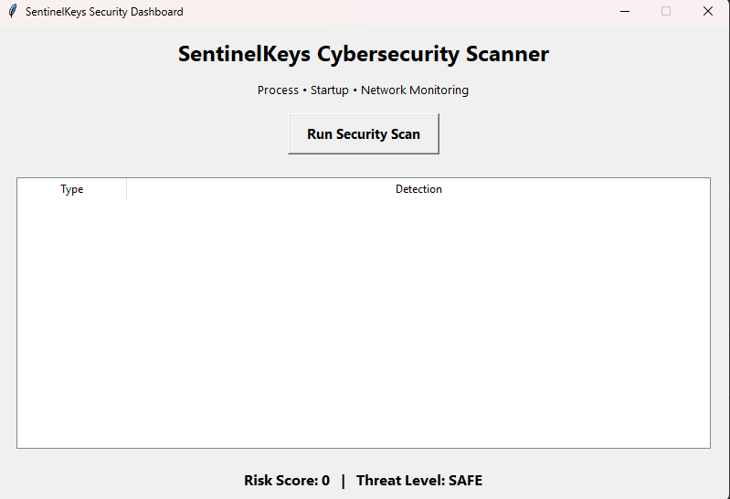
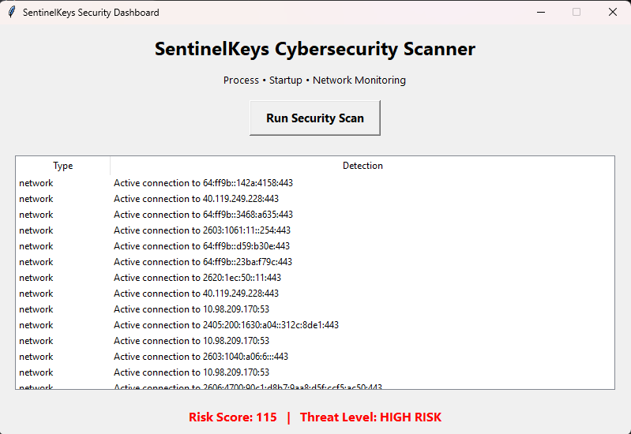

# 🛡️ Keylogger Project: SentinalKeys Detect

A Python-based security monitoring tool that detects suspicious processes, startup persistence, and unusual network connections.  
The project includes a graphical dashboard that visualizes threats and generates security reports.

---

# 🚀 Features

✔ Security Scan Button  
✔ Live Detection Table  
✔ Risk Score Engine  
✔ Automatic Report Generation  
✔ Real-Time Monitoring 

---

# 🖥️ Dashboard Preview

## Main Interface


## Threat Detection Example


---

# 🧠 How It Works

The tool scans your system in three stages:

### 1️⃣ Process Monitoring
Detects suspicious processes that may be logging keystrokes or spying.

Examples detected:
- keylogger
- hook services
- spyware
- unknown background loggers

### 2️⃣ Startup Persistence Check
Malware often adds itself to startup folders to survive reboot.

The scanner checks for suspicious startup files.

### 3️⃣ Network Activity Analysis
Identifies active outbound connections that could be sending stolen data.

---

# ⚙️ Tech Stack

**Language**
- Python

**Libraries**
- psutil
- tkinter
- reportlab

**Concepts**
- Endpoint monitoring
- Threat detection
- Risk scoring
- Security reporting

---

# 📂 Project Structure

```
sentinelkeys-security-dashboard
│
├── gui_main.py
├── dashboard.py
├── process_scanner.py
├── startup_scanner.py
├── network_monitor.py
├── risk_engine.py
├── report.py
├── requirements.txt
├── GUI.png
├── GUI2.png

```

---

# 🔧 Installation

Clone the repository

```
git clone https://github.com/kavya-seth-vns/keylogger.git
```

Move into the folder

```
cd keylogger
```

Install dependencies

```
pip install -r requirements.txt
```

Run the dashboard

```
python gui_main.py
```

---

# 🧪 Testing the Tool

### Test Suspicious Process Detection

Run a test script named:

```
keylogger_test.py
```

Then start the scanner.

The dashboard should flag it as suspicious.

---

### Test Startup Detection

Open startup folder:

```
Win + R
shell:startup
```

Create a fake file like:

```
keyboard_logger_test.bat
```

Run the scanner again.

---

# 📊 Example Output

```
Threat Detection Results

PROCESS  Suspicious process name: keylogger_test (PID 3244)
STARTUP  Suspicious startup item: keyboard_logger_test.bat
NETWORK  Active connection detected

Risk Score: 65
Threat Level: MEDIUM
```

---

# 📄 Generated Report

The tool automatically generates:

```
security_report.txt
```

Containing scan results and risk analysis.

---

# 🎯 Project Purpose

This project demonstrates:

- Cybersecurity fundamentals
- Malware behavior detection
- Endpoint monitoring techniques
- Python security tool development

It is designed as a **portfolio project for cybersecurity learners.**

---

# 🔮 Future Improvements

- Malware hash checking
- Threat intelligence API integration
- Real-time system monitoring
- Advanced anomaly detection
- Web dashboard version

---

# 👩‍💻 Author

**Kavya Seth**

Cybersecurity Student  
Ethical Hacking Enthusiast  
Security Tool Developer

---

# ⭐ Support

If you like this project, consider giving it a star.
